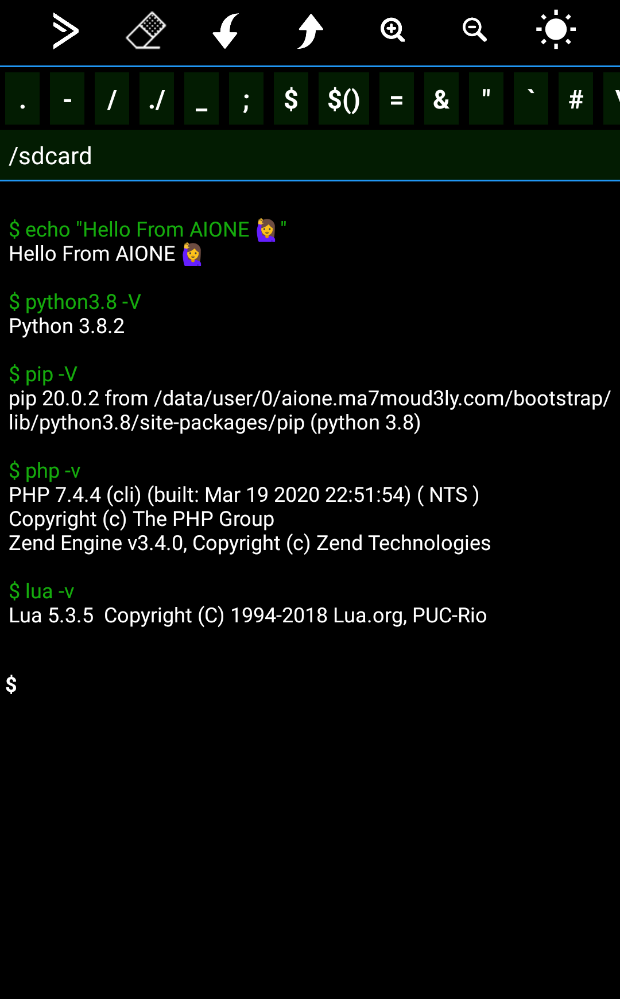
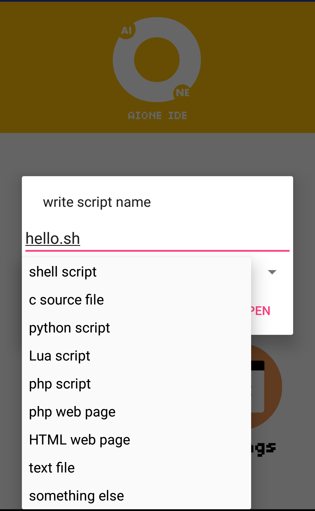
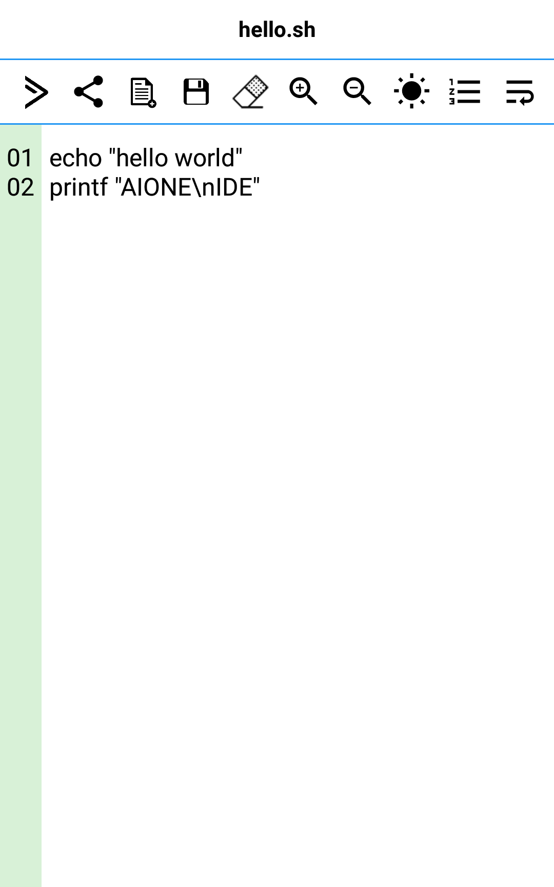
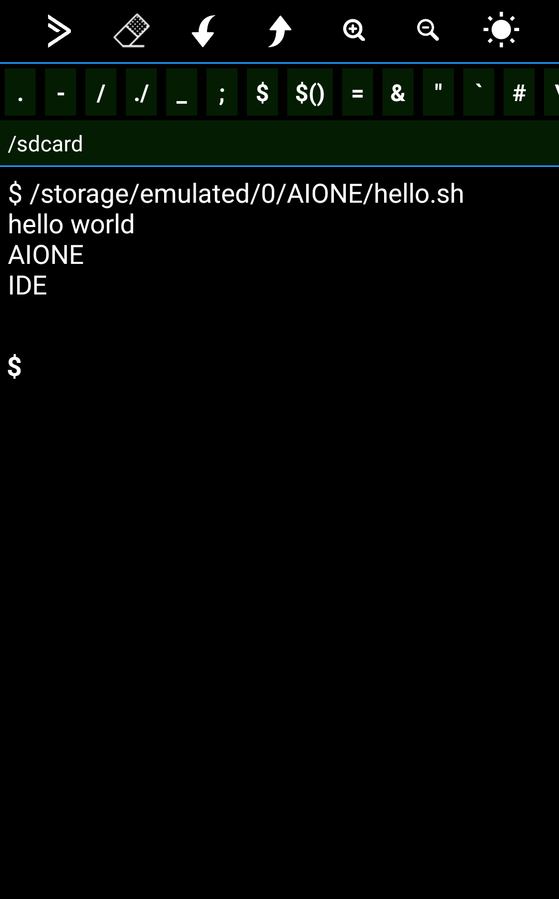
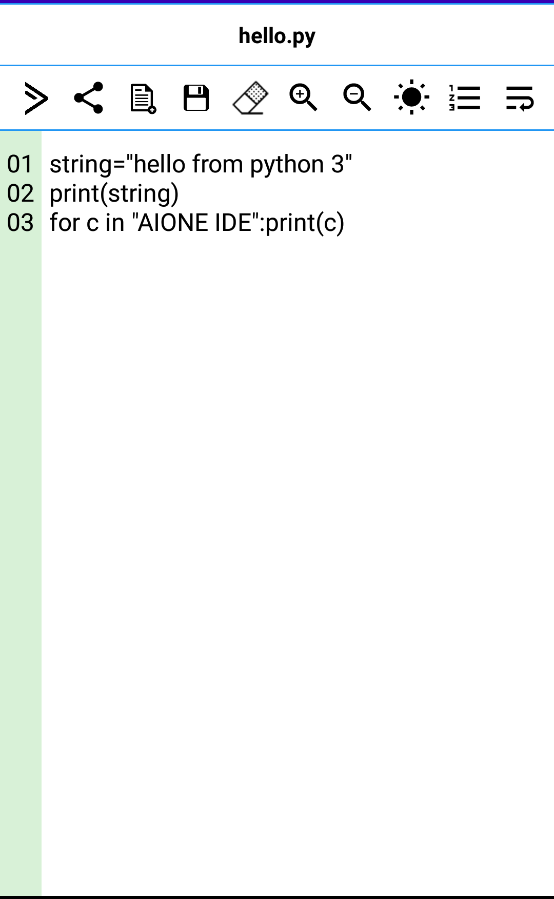
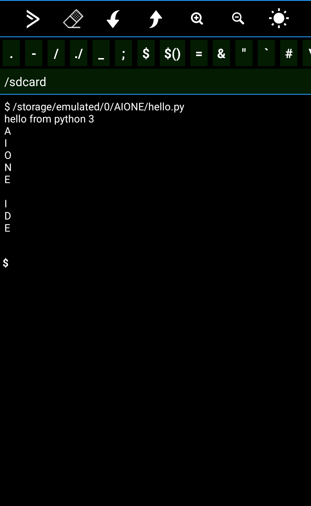
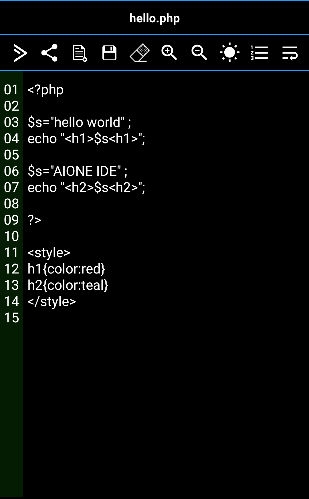

<div align="center">
  <a href="https://play.google.com/store/apps/details?id=aione.ma7moud3ly.com" target="_blank">
    
  </a>

# [AIONE (All In One) IDE](https://play.google.com/store/apps/details?id=aione.ma7moud3ly.com) 
``` 
Have you imagined to write python, lua, html, php and shell from your smart phone using a single IDE?
Don't worry .. AIONE has made it real...
```
#### <div align="left">AIONE:</div>
- Is an integrated development environment IDE, has a nice text editor and a smart command line.
- Gives you the power to write, execute and debug your scripts in your preferred language.
- AIONE now supports Python3 - Lua - PHP and Shell scripting language as custom command line language..

<br>
<div>
  
  
  
  
</div>
<br>
<div>
  
  
  
  
</div>
<br>
[Download From Google Play](https://play.google.com/store/apps/details?id=aione.ma7moud3ly.com) 
</div>
